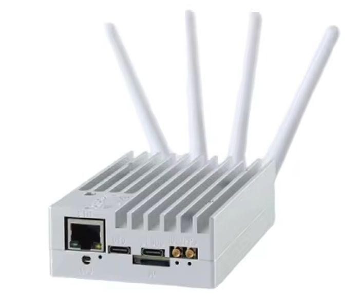

# openwifi porting to LibreSDR platform
Porting is intendend for the hardware [rev.5](https://github.com/hz12opensource/libresdr/blob/main/zynqsdr_rev5.pdf)
The Hardware/FPGA porting can be found [here](https://github.com/pavelyazev/openwifi-hw) (branch libresdr)

## Prebuilt image
The prebuilt image can be downloaded by [the link](https://drive.google.com/file/d/1jdm3h4T_fK9V34tB4Ktzpux67boUa6jo/view?usp=sharing)
The image is based on [the original image](https://drive.google.com/file/d/12egFLT9TclmY8m3vCMHmUuSne3qK0SWc/view?usp=sharing) where 
the BOOT partition has been updated with new boot image, device three and kernel image files. The setup_once.sh script has been also modified 
to support LibreSDR platform. The image is suitable only for LibreSDR.
To run the openwifi staff it is necessary to follow [the original instruction] (https://github.com/open-sdr/openwifi#download-img-and-quick-start)
Only AP operation was tested.
